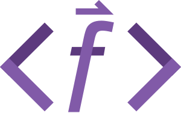

# SVG writer for Fortran

<div align="left">

</div>

# API
```fortran
use svgf
type(svg) :: svg_instance
type(g_element), pointer :: g_ptr
type(line_element), pointer :: line_ptr

call create_svg(svg_instance, 100*pt, 100*pt)

call svg_instance%line(line_ptr, 0*pt, 0*pt, 50*pt, 50*pt)
call svg_instance%g(g_ptr, id="group1")
call g_ptr%line(line_ptr, 50*pt, 50*pt, 100*pt, 0*pt)
call line%set_attrs("stroke-width","3")

write(*,*) svg_instance%serialize()
```
